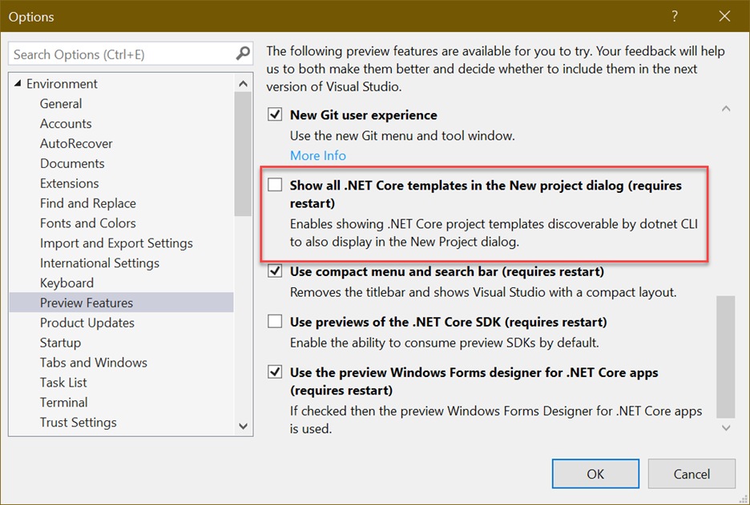
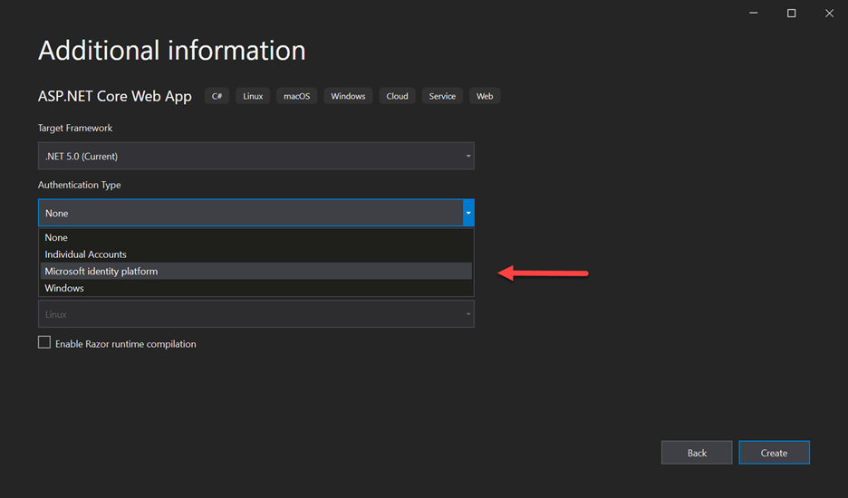

# Creating ASP.NET Core projects with Microsoft identity platform(Azure AD/B2C).

Adding Azure based authentication to a new ASP.NET Core project with the Microsoft identity platform (AAD/B2C). In the 16.9 release of Visual StudioStudio, we updated the ASP.NET Core templates to allow you to use the Microsoft Identity Platform for authenticationwe have updated the ASP.NET Core templates to enable users to create those projects with auth provided by the Microsoft identity platform. We are still working to provide an experience where you can specific specify the auth options in Visual Studio 2019 and have it proviregistered with the Microsoft identity platformion and configuree the generated project. With the new auth option, Microsoft identity platform, In in the 16.9 release, we have added a new auth option:, Microsoft identity platform. You can create projects that are setup to for authentication, but there will be some additional work that you&#39;ll need to perform to complete the process. This document will walks you through the available options that are available. In a later update to Visual Studio we will streamline this experience so that all steps can be performed in Visual Studio itself.

The options are:

- Option 1: Go back to the previous experience that took care of all the steps (but with legacy limitations)
- Option 2: Use a dotnet global command line tool provided by Microsoft identity platform in 16.9 to register an app, and configure the code for you, or configure the code from an existing app. This tool also works if you created your project with the dotnet new command
- Option 3: Do it all by yourself using the Microsoft identity platform and samples.

Before we explore how to use the Microsoft identity platform option, if you would prefer to go back to the previous experience where Visual Studio took care of all the steps you can do that. Let&#39;s see how to do that first.

## Option 1: Go back to the previous experience that took care of all the steps (but does not generate code to call graph or a web API)

Prior to the 16.9 release, Visual Studio 2019 had support for users to specify the auth options, and it would take care of provisioning the needed Azure Azure AD App Registration objects and to configuringe the project to use thosewith the right settings. However, this approach however it doesdid not generate code to call Microsoft Graph or another web API. The projects created with this experience do not use the new Microsoft identity web packages, but instead relied on auth packages provided in ASP.NET Core itself. The current recommendation is to use Microsoft identity web, but the approach prior to 16.9 continues to work, and is fully supported. To go back to the prior previous experience, in 16.9 you can uncheck the preview flag, _Show all .NET Core templates in the New Project dialog_, shown below. You can find this option by going to _Tools \&gt; Options \&gt; Environment \&gt; Preview Features_.

After unchecking this checkbox, and restarting Visual Studio, when you create a new ASP.NET Core project, you will have the same options that were available previously. Now Llet&#39;s move on to discuss how you can easily add Microsoft identity web to new ASP.NET Core projects created with this options selected.

## Option 2: Use the tool

When using Visual Studio 16.9, if you create a new ASP.NET Core project and select the _Microsoft identity platform_ auth option, the project will be created so that it will use Azure basedAzure AD or B2C for authentication. This e Awillzu not automatically provision the App Registrations re objects will not automatically be provisioned by Visual Studio,. The App Registration provisioning that will be coming in an upcoming release soon. To make the generated project runnablecomplete the authentication configuration and make the project runnable, you need to perform the following two things are neededsteps.

1. Provision necessary Azure AD or B2C App Registrations objects
2. Configure the project to use the newly provisioned Azure App Registration settings objects

There is a command line tool that you can use to perform these actions for you. First you&#39;ll need to install the tool with the command below.

dotnet tool install -g msidentity-app-sync

_TODO__: replace with instructions to use nuget package once it has been published_

1. Clone the repository at [https://github.com/AzureAD/microsoft-identity-web](https://github.com/AzureAD/microsoft-identity-web)
2. cd into the directory where the repo was cloned
3. Pack the project into a nuget package with the command dotnet pack .\tools\app-provisioning-tool\app-provisioning-tool\ms-identity-app.csproj
4. Install the tool locally with the command dotnet tool install -g --add-source .\tools\app-provisioning-tool\app-provisioning-tool\nupkg\ ms-identity-app

After completing these this steps, the ms-identity-appmsidentity-app-sync tool should installed and ready for use be available. You can verify verify that the tool was installed successfully that by running the command dotnet tool list -g. You should see the ms-identity-appmsidentity-app-sync listed in the results shown in the console.

TODO: add output screenshot here

Now that the tool is installed, and ready to be used, you&#39;ll need toNext, you need ensure that you are signed into your Azure accountsubscription. You can sign in with any of the following tools.

- [Visual Studio 2019](https://docs.microsoft.com/en-us/visualstudio/ide/signing-in-to-visual-studio?view=vs-2019#how-to-sign-in-to-visual-studio)
- [Azure CLI](https://docs.microsoft.com/en-us/cli/azure/authenticate-azure-cli)
- [Azure PowerShell](https://docs.microsoft.com/en-us/powershell/azure/authenticate-azureps?view=azps-5.5.0)

Once you sign in with either any of these tools, the account will be available for use with the you can start using the app identity syncprovisioning tool. Now that you are signed in, lLet&#39;s take a looklook at how usingto use the tool to provision the Azure objectsa new App Registration and configure the project. We will start by taking a look at the built in help for this command. To seeTo get a list of the available built-in commandsoptions the built in help execute the commandrun: ms-identity-appmsidentity-app-sync –help (or ms-identity-appmsidentity-app-sync -h). The current help output is shown in the image below.

From the help output, you can see that all the options are optional. You&#39;ll typically want to execute this command from the same in the directory that contains the project file (Or solution in the case of Blazor WebAssemblywasm hosted code) that you are trying to update. If you execute this command without any parameters, the following will occur (_assuming you are signed into a single Azure account_).

- The tool will detect what type of asp.net core app the project represents, the supported project types include; web (webapp and mvc templates), web apiAPI, Blazor Server and Blazor WebAssembly (hosted or not).
- The tool will detect which type of auth the project is configured forfor.
- A new Azure Azure AD Aapplication object registration iswill be created in the [home tenant](https://docs.microsoft.com/en-us/azure/active-directory/develop/single-and-multi-tenant-apps#:~:text=Azure%20Active%20Directory%20(Azure%20AD,their%20security%20and%20operational%20policies.) of the signed in user
- The project will be updated to connect the app with the Azure objects created

If you are signed in to Azure with multiple users, you will need to specify which user should be used with the –username parameter. If you&#39;d like to use an existing Azure AD (or Azure AD B2C) tenant or existing application, you can use the –tenant-id and –client-id parameters respectively. More on this later. For more info on the tool visit the GitHub repository where the code is at [microsoft-identity-web](https://github.com/AzureAD/microsoft-identity-web/tree/jennyf/proviTool/tools/app-provisioning-tool) Github repository. Now that we&#39;ve gone over the basic usage of the tool, let&#39;s go ahead and run it.

We want to use the tool to create a new tenant, App Registration client id and to and configure the project. For this scenario we can just execute the tool without any additional parameters. After launching a console, or PowerShellOpen the terminal of your choice, you should cd and navigate into the directory where the project was createdour code resides. After that you can simply executeNext, run the tool without any parameters, by calling msidentity-app-sync. Let&#39;s see that in action.

First let&#39;s create a new ASP.NET Core web application, that is configured for authentication using Azure AD with a single organization. After we create the project, we will use the tool to provision the needed objects in Azure and configure the project.

**1: Create the project**

To create the project, you can use Visual Studio 2019 16.10, or dotnet new. When using Visual Studio, select the _Microsoft identity platform_ option for authentication on the Additional Information page of the New Project Dialog.

If you are using dotnet new to create the project you should pass the value of SingleOrg for the –auth parameter. For example, you can use this command dotnet new webapp –auth SingleOrg to create the project. Now that we have created the project, let&#39;s use the tool to take care of the auth related.

**2: Update auth**

In many cases you can use the tool without passing any parameters. You will want to cd into the directory where the project file (.csproj file) is located, and then run the tool. Let&#39;s try it by running msidentity-app-sync. If you are configuring a Blazor WebAssembly app, run the tool in the directory where the solution (.sln) file is located.

From the output in the console, we can see that the tool detected that we have an ASP.NET Core web application. Following that, we can see that the appSettings.json file was updated to use the azure objects that the tool provisioned. In some cases, you may need to pass in a username for the action complete. This username should be a username for a user in your home tenant (or the tenant that is passed in with –tenant-id). Now that we have configured this project, you can run the web app and sign in with users in the tenant. Let&#39;s briefly discuss some of the other options that the tool makes available.

By default, the tool will create new App Registrations in your &quot;home tenant&quot;, in order to create new App Registrations in different tenants that you have access to, pass the id of the tenant in the –tenant-id parameter. In particular Visual Studio 2019 16.9 will create an Azure AD application. If you want to register a B2C application you&#39;ll need to provide both –tenant-id, and –susi-policy-id (name of your SUSI policy). By default the tool uses your identity that you have signed into Visual Studio with. If you are signed in in VS with several identities, you also need to use the –username option.

By default, the tool will create a new Azure AD or AzureAD B2C application. To use an existing a client application, pass in the id of that application in the –client-id parameter.

In order to use an existing App Registration, use the –client-id parameter and pass in the value of the existing App Registration.

First you need to determine what type of auth that you&#39;d like to support in your new project.

**Notes from meeting**

How to login?

- Sign into Azure with either Visual Studio or Azure CLI or Azure PowerShell

**What is the default behavior when no parameters are passed in?**

- See the [readme](https://github.com/AzureAD/microsoft-identity-web/blob/jennyf/proviTool/tools/app-provisioning-tool/README.md)
- Creates a new app in the home tenant

## Option 3: Do everything manuallyHow to configure without the provisioning tool

If you would like to perform all the steps without using the provisioning tool, there are some quick start guides that you can use. The specific steps will be different based on you project type. Use the links below to get started with that.

- Web app [Quickstart: Add sign-in with Microsoft to an ASP.NET Core web app - Microsoft identity platform | Microsoft Docs](https://docs.microsoft.com/en-us/azure/active-directory/develop/quickstart-v2-aspnet-core-webapp)
- Web api API [Quickstart: Protect an ASP.NET Core web API with the Microsoft identity platform - Microsoft identity platform | Microsoft Docs](https://docs.microsoft.com/en-us/azure/active-directory/develop/quickstart-v2-aspnet-core-web-api)
- Blazor [Tutorial - Create a Blazor Server app that uses the Microsoft identity platform for authentication - Microsoft identity platform | Microsoft Docs](https://docs.microsoft.com/en-us/azure/active-directory/develop/tutorial-blazor-server)
- Blazor WASM [Tutorial - Sign in users and call a protected API from a Blazor WebAssembly app - Microsoft identity platform | Microsoft Docs](https://docs.microsoft.com/en-us/azure/active-directory/develop/tutorial-blazor-webassembly)
- gRPC
